# 🚗 Auto Parts Inventory & Ordering System - Frontend

A modern, responsive Next.js frontend for managing auto parts inventory with real-time updates, authentication, and analytics.

## 📸 Screenshots

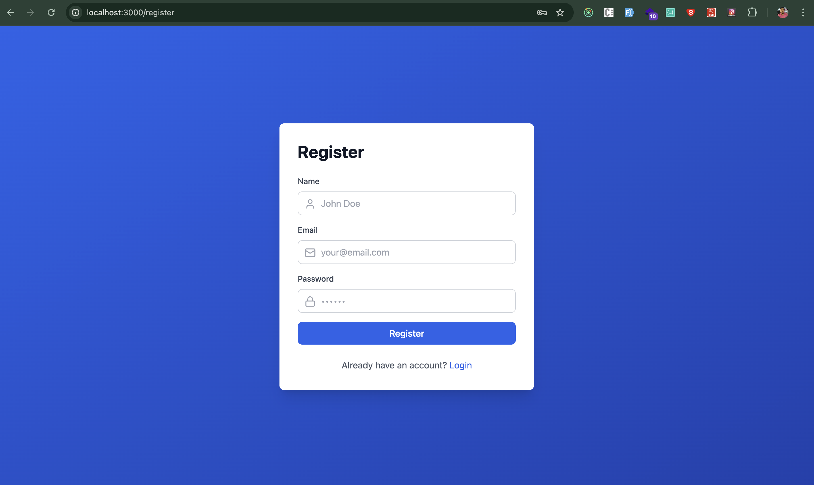

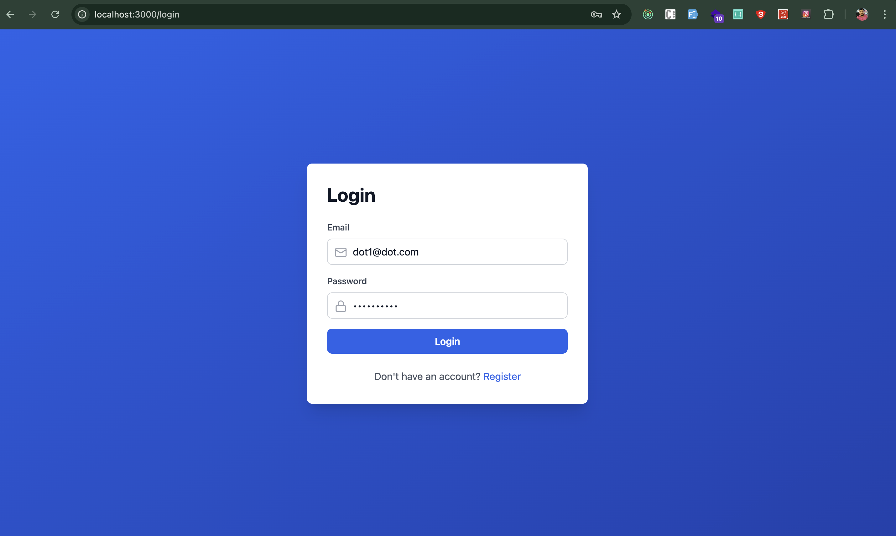

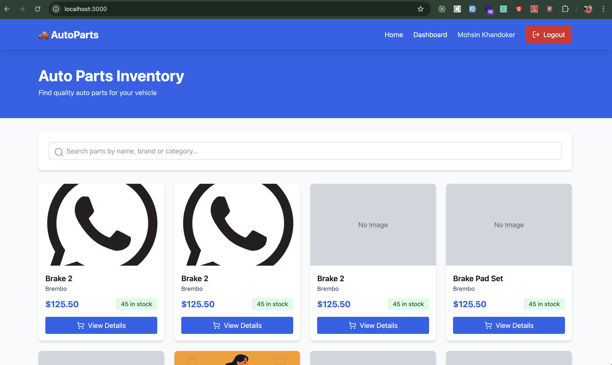

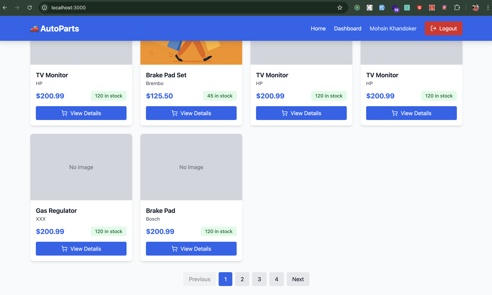

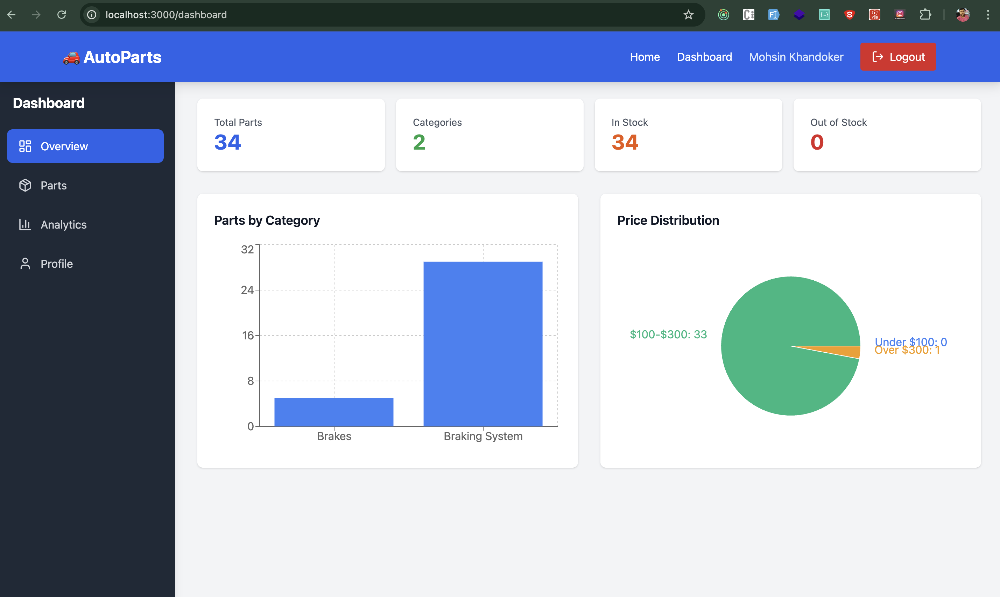

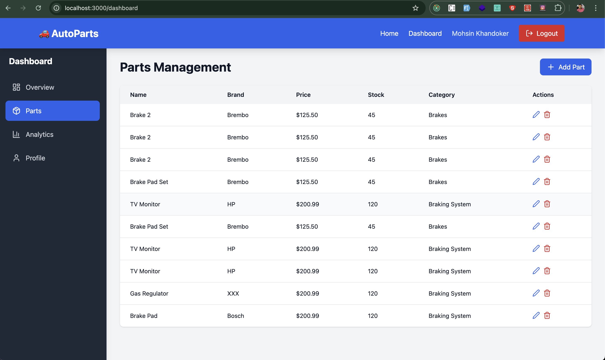

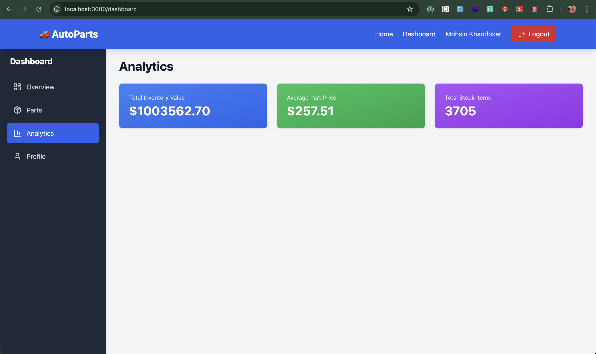

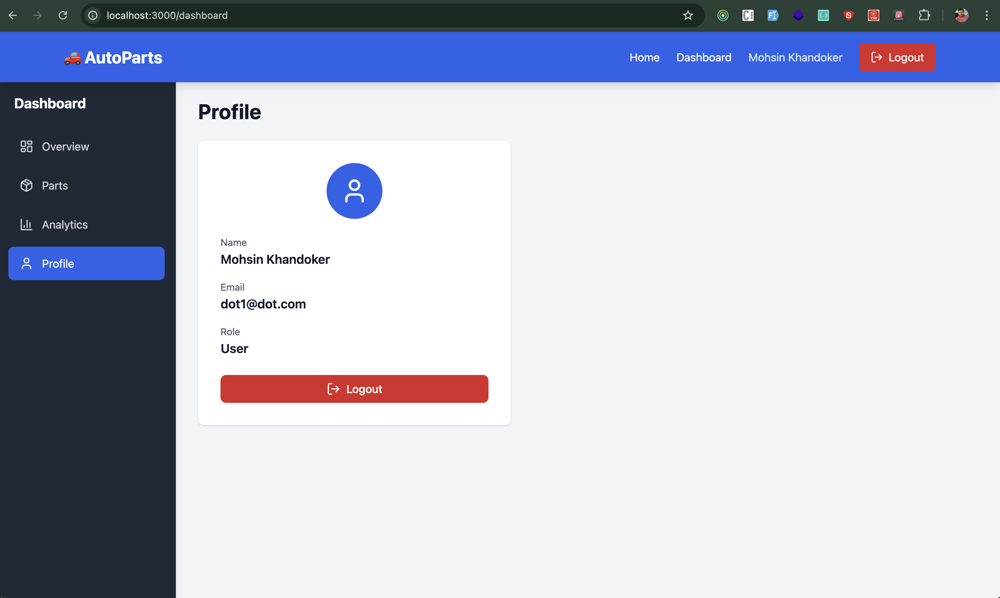

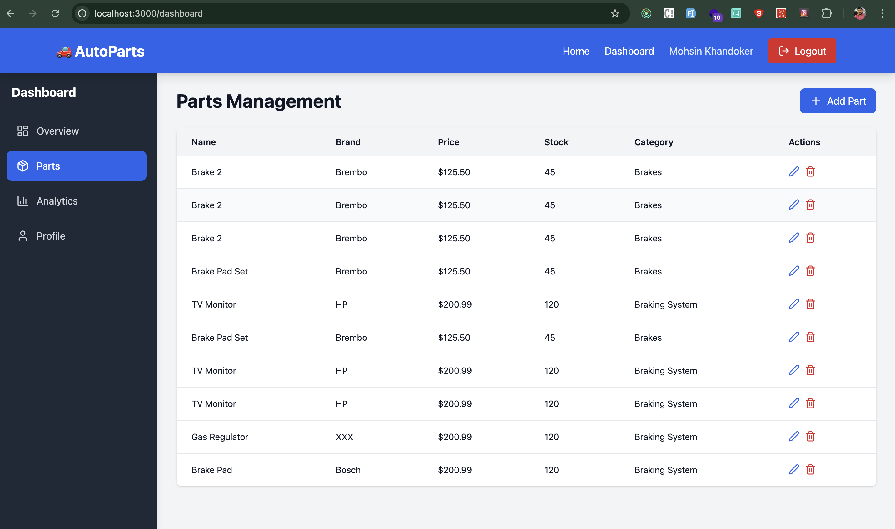

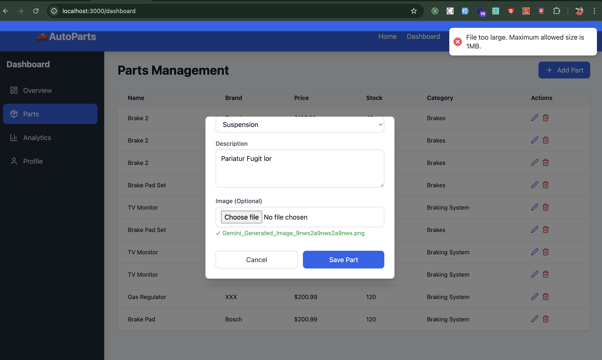

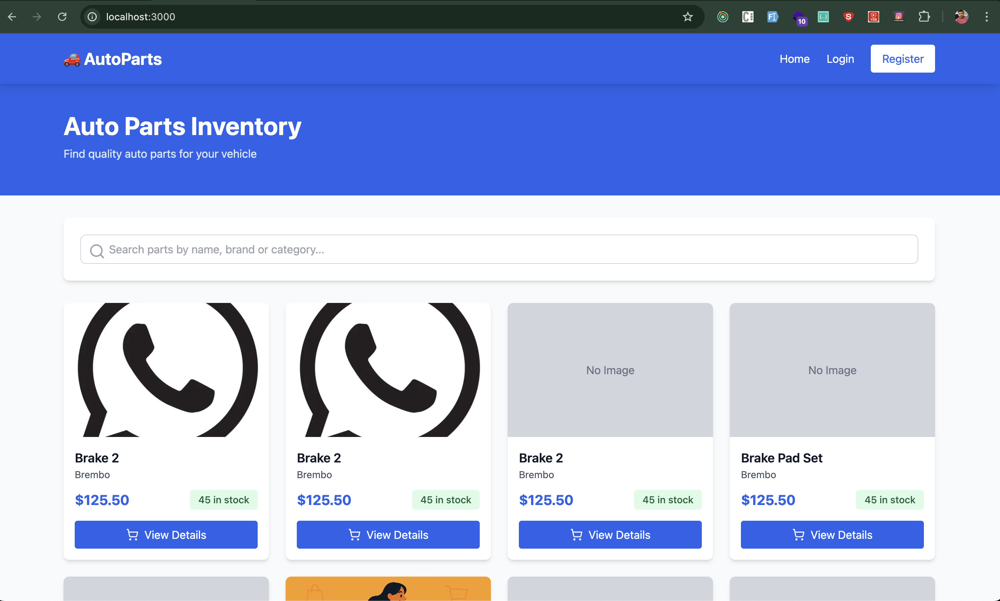

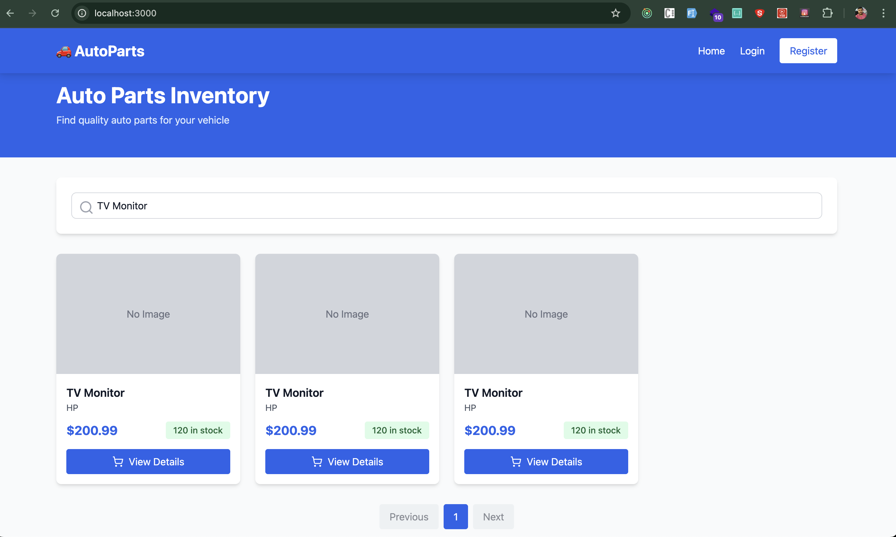

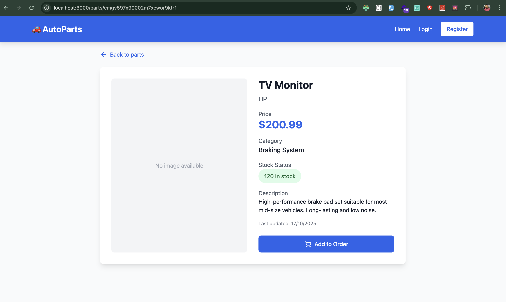

### 🔐 Authentication

<!-- Add your screenshots here -->

- **Login Page** - Clean, modern login form with validation
- **Register Page** - User registration with error handling
- **Password Recovery** - Secure password reset flow

### 🏠 Homepage

<!-- Add your screenshots here -->

- **Parts Listing** - Server-side rendered with search & filter
- **Category Filter** - Browse by Brakes, Engine, Suspension, etc.
- **Pagination** - Navigate through parts list efficiently
- **Part Card** - Image, price, stock status, and details

### 📊 Dashboard

<!-- Add your screenshots here -->

- **Overview** - Analytics with charts and statistics
- **Parts Management** - Create, read, update, delete parts
- **Parts Table** - Full CRUD operations with image upload
- **Analytics** - Price distribution, category breakdown
- **User Profile** - Account details and logout

### 🎨 Detail Page

<!-- Add your screenshots here -->

- **Part Details** - Full product information with image
- **Stock Status** - Real-time availability
- **Add to Order** - Call-to-action button

---

## 🛠️ Tech Stack

| Layer                  | Technology                   |
| ---------------------- | ---------------------------- |
| **Framework**          | Next.js 14+                  |
| **Language**           | TypeScript                   |
| **Styling**            | Tailwind CSS                 |
| **Forms**              | React Hook Form + Zod        |
| **Data Fetching**      | React Query (TanStack Query) |
| **State Management**   | Zustand                      |
| **HTTP Client**        | Axios                        |
| **Authentication**     | JWT (Access + Refresh)       |
| **Icons**              | Lucide React                 |
| **Charts**             | Recharts                     |
| **Notifications**      | React Hot Toast              |
| **Image Optimization** | Next.js Image Component      |

---

## ✨ Features

### 🔐 **Authentication**

- ✅ User registration and login
- ✅ JWT-based authentication
- ✅ Automatic token refresh
- ✅ Protected routes with middleware
- ✅ Cookie-based session persistence

### 🏠 **Homepage (SSR)**

- ✅ Server-side rendering for SEO
- ✅ Real-time parts listing
- ✅ Search functionality
- ✅ Category filtering
- ✅ Pagination support
- ✅ Responsive grid layout

### 📄 **Part Details (SSG + ISR)**

- ✅ Static generation at build time
- ✅ Incremental Static Regeneration (30s)
- ✅ Product image display
- ✅ Detailed specifications
- ✅ Stock availability status

### 📊 **Dashboard (CSR)**

- ✅ Protected dashboard area
- ✅ Overview with analytics
- ✅ Parts management CRUD
- ✅ Image upload to Cloudinary
- ✅ Statistics and charts
- ✅ User profile management

### 🎯 **Parts Management**

- ✅ Create new parts with images
- ✅ Edit existing parts
- ✅ Delete parts with confirmation
- ✅ Real-time table updates
- ✅ Image preview before upload
- ✅ Form validation

### 📈 **Analytics**

- ✅ Total parts count
- ✅ Stock overview
- ✅ Price distribution chart
- ✅ Category breakdown
- ✅ Inventory value

---

## 🚀 Quick Start

### Prerequisites

- Node.js 20+
- npm or yarn
- Backend API running on `http://localhost:4000`

### Local Installation

```bash
# 1. Clone repository
git clone <repo-url>
cd project folder

# 2. Install dependencies
npm install


# 4. Update API URL in .env.local
NEXT_PUBLIC_API_URL=http://localhost:4000/api
```

### Development

```bash
npm run dev
# Open http://localhost:3000
```

### Build for Production

```bash
npm run build
npm start
```

---

## 📝 Environment Variables

```bash
# .env.local
NEXT_PUBLIC_API_URL=http://localhost:4000/api
```

### Environment Description

| Variable              | Purpose              | Example                     |
| --------------------- | -------------------- | --------------------------- |
| `NEXT_PUBLIC_API_URL` | Backend API endpoint | `http://localhost:4000/api` |

---

## 📁 Project Structure

```
frontend/
├── app/                          # Next.js App Router
│   ├── layout.tsx                # Root layout
│   ├── page.tsx                  # Homepage (SSR)
│   ├── login/page.tsx            # Login page
│   ├── register/page.tsx         # Register page
│   ├── parts/[id]/page.tsx       # Part details (SSG)
│   ├── dashboard/page.tsx        # Dashboard (protected)
│   ├── globals.css               # Global styles
│   └── error.tsx                 # Error boundary
│
├── components/                   # React components
│   ├── Navbar.tsx                # Navigation bar
│   ├── Sidebar.tsx               # Dashboard sidebar
│   ├── PartCard.tsx              # Part display card
│   ├── PartFormModal.tsx         # CRUD form
│   ├── Providers.tsx             # App providers
│   └── dashboard/                # Dashboard components
│       ├── DashboardOverview.tsx
│       ├── PartsManagement.tsx
│       ├── Analytics.tsx
│       └── Profile.tsx
│
├── hooks/                        # Custom React hooks
│   ├── useAuth.ts                # Authentication hook
│   └── useParts.ts               # Parts queries
│
├── lib/                          # Libraries
│   └── api.ts                    # Axios instance
│
├── store/                        # State management
│   └── auth.ts                   # Zustand auth store
│
├── utils/                        # Utilities
│   ├── validation.ts             # Zod schemas
│   └── format.ts                 # Format helpers
│
├── public/                       # Static assets
├── middleware.ts                 # Route protection
├── next.config.js                # Next.js config
├── tailwind.config.js            # Tailwind config
├── tsconfig.json                 # TypeScript config
├── Dockerfile                    # Docker image
├── .dockerignore                 # Docker ignore
├── .env.example                  # Env template
├── package.json                  # Dependencies
└── README.md                     # This file
```

---

## 🐳 Docker Setup

### Build in Docker

GO PROJECT FOLDER and RUN BELLOW COMMAND

### Run Docker Container

Before starting the frontend, make sure the backend are running.

```bash
# Start all services (backend, frontend, database)
docker compose build --no-cache

docker-compose up -d


# Stop all services
docker-compose down

---

## 🔄 API Integration

### Base URL

```

http://localhost:4000/api

```

### Authentication Flow

```

1. User logs in → POST /auth/login
   ↓
2. Backend returns tokens (accessToken, refreshToken)
   ↓
3. Tokens saved to:
   - Zustand store (client state)
   - Cookies (server state)
     ↓
4. API interceptor attaches JWT to all requests
   ↓
5. On 401 error → Auto-refresh token
   ↓
6. On refresh fail → Redirect to /login

````

### Key Endpoints

| Method | Endpoint         | Auth | Purpose                   |
| ------ | ---------------- | ---- | ------------------------- |
| POST   | `/auth/register` | ❌   | Register user             |
| POST   | `/auth/login`    | ❌   | Login user                |
| POST   | `/auth/logout`   | ✅   | Logout user               |
| GET    | `/parts`         | ❌   | Get all parts (paginated) |
| GET    | `/parts/:id`     | ❌   | Get single part           |
| POST   | `/parts`         | ✅   | Create part (admin)       |
| PUT    | `/parts/:id`     | ✅   | Update part (admin)       |
| DELETE | `/parts/:id`     | ✅   | Delete part (admin)       |

---

## 🔐 Authentication

### Login Flow

```typescript
// 1. User submits credentials
POST /auth/login { email, password }

// 2. Backend returns
{
  user: { id, name, email, role },
  accessToken: "jwt...",
  refreshToken: "jwt..."
}

// 3. Frontend saves
- Zustand: user data + tokens
- Cookies: tokens (for server-side)

// 4. Middleware checks cookies on dashboard access
// 5. API interceptor uses Zustand token
````

### Token Refresh

```typescript
// Auto-triggered on 401
POST /auth/refresh { refreshToken }

// Returns new tokens
{
  accessToken: "new_jwt...",
  refreshToken: "new_jwt..."
}
```

---

## 🎯 Rendering Strategies

| Page           | Strategy  | Reason                   |
| -------------- | --------- | ------------------------ |
| `/`            | SSR       | Dynamic data, SEO        |
| `/parts/[id]`  | SSG + ISR | Performance, SEO         |
| `/login`       | CSR       | No auth required         |
| `/register`    | CSR       | No auth required         |
| `/dashboard/*` | CSR       | Protected, user-specific |

---

## 🧪 Testing

### Build Test

```bash
npm run build
```

### Production Start

```bash
npm run build
npm start
```

---

## 📊 Performance Optimizations

✅ **Image Optimization** - Next.js Image component for lazy loading  
✅ **Code Splitting** - Automatic route-based code splitting  
✅ **Incremental Static Regeneration** - Fresh data every 30s  
✅ **Server-Side Rendering** - Homepage for SEO  
✅ **Caching** - React Query stale time configuration  
✅ **Minification** - Automatic production build optimization

---

## 🛡️ Security

✅ **JWT Authentication** - Secure token-based auth  
✅ **HTTPS Ready** - SSL/TLS support  
✅ **CORS Configuration** - Secure cross-origin requests  
✅ **Input Validation** - Zod schema validation  
✅ **XSS Protection** - React escaping  
✅ **CSRF Token** - Automatic with Next.js

---

## 🤝 Contributing

1. Fork the repository
2. Create feature branch (`git checkout -b feature/AmazingFeature`)
3. Commit changes (`git commit -m 'Add AmazingFeature'`)
4. Push to branch (`git push origin feature/AmazingFeature`)
5. Open Pull Request

## 🎉 Key Features Checklist

- [x] User authentication (login/register)
- [x] JWT-based security
- [x] Server-side rendering (SSR)
- [x] Static site generation (SSG)
- [x] Client-side rendering (CSR)
- [x] Protected routes
- [x] CRUD operations
- [x] Image upload
- [x] Real-time search
- [x] Pagination
- [x] Analytics dashboard
- [x] Error handling
- [x] Loading states
- [x] Responsive design
- [x] Docker support
- [x] TypeScript
- [x] Form validation

---
